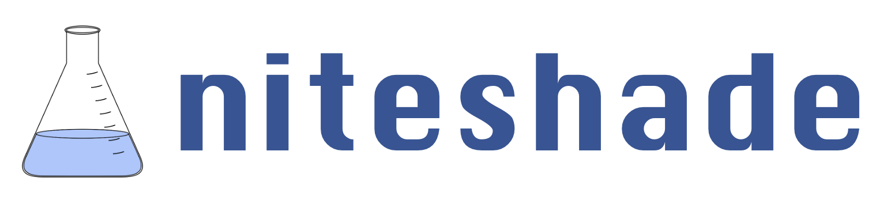

.. image:: https://img.shields.io/pypi/v/niteshade
    :target: https://pypi.org/project/niteshade/
    :alt: PyPI

.. image:: https://img.shields.io/pypi/pyversions/niteshade
    :target: https://pypi.org/project/niteshade/   
    :alt: PyPI - Python Version

.. image:: https://img.shields.io/pypi/l/niteshade
    :target: https://pypi.org/project/niteshade/
    :alt: PyPI - License

========================================

|

**niteshade** (/ˈnaɪt.ʃeɪd/) is a Python library for simulating data poisoning 
attack and defence strategies against online machine learning systems. The 
library is written in Python 3.10 and offers a *simple* and *intuitive* API 
which is heavily integrated with PyTorch's machine learning framework.

For further details about the project, including background information, 
example usage and detailed API documentation, visit 
https://oskarfernlund.github.io/niteshade/.

Installation
------------

niteshade requires Python 3.8 or higher.

niteshade binaries may be installed from PyPI using pip 
https://pypi.org/project/niteshade/.

.. code-block:: console

    $ pip install niteshade

Use of a virtual environment is *strongly* recommended. 

**Note:** Installation with Anaconda is not currently available. Anaconda users 
should install niteshade with pip inside an Anaconda environment.

Usage
-----

niteshade is a library of functions and classes which allow users to easily 
specify data poisoning attack and defence strategies and simulate their effects 
against online learning using PyTorch models. Detailed information regarding 
the python API and example usage can be found at 
https://oskarfernlund.github.io/niteshade/.

Dependencies
------------

This project has separate package and developer dependencies, both of which can 
be found in the ``env/`` directory in the form of ``requirements.txt`` and 
``environment.yml`` files for pip and Anaconda users. Package dependencies 
(prefixed with "pkg") consist exclusively of the packages required to use the 
library and are installed automatically when niteshade binaries are installed 
with pip. Developer dependencies (prefixed with "dev"), include the package 
dependencies as well as additional packages required for building the 
documentation, running tests, linting the source code and publishing releases.

.. code-block:: console

    $ cd env/

pip users:

.. code-block:: console

    $ pip install -r dev_requirements.txt # or pkg_requirements.txt

Anaconda users:

.. code-block:: console

    $ conda env create -f dev_environment.yml # or pkg_environment.yml

Building the Documentation
--------------------------

To build documentation in various formats, you will need Sphinx and the 
readthedocs theme (included in the developer dependencies). You can build the 
documentation by running ``make <format>`` from the ``docs/`` directory. Run 
``make`` to get a list of all available output formats.

.. code-block:: console

    $ cd docs/
    $ make clean && make <format>

Running Unit and Integration Tests
----------------------------------

This project uses pytest for unit and integration testing (included in the 
developer dependencies). The tests may be run from the root directory as 
follows:

.. code-block:: console

    $ pytest
    ...
    ===== x passed, x warnings in x.xx seconds =====

Releases
--------

Releases are published to PyPI automatically when a tag is pushed to GitHub.

.. code-block:: console

    $ export RELEASE=x.x.x
    $ git commit --allow-empty -m "Release $RELEASE"
    $ git tag -a $RELEASE -m "Version $RELEASE"
    $ git push origin --tags

Contributing
------------

niteshade is an open-source project and contributions are welcome.

The Team
--------

niteshade was co-created by Mart Bakler, Oskar Fernlund, Alexandra 
Ntemourtsidou, Jaime Sabal-Bermudez and Mustafa Saleem in 2022 at Imperial 
College London. The authors may be contacted at the following email addresses:

- Mart Bakler: mart.bakler21@imperial.ac.uk
- Oskar Fernlund: oskar.fernlund21@imperial.ac.uk
- Alexandra Ntemourtsidou: alexandra.ntemourtsidou15@imperial.ac.uk
- Jaime Sabal-Bermudez: jaime.sabal-bermudez21@imperial.ac.uk
- Mustafa Saleem: mustafa.saleem21@imperial.ac.uk

Many thanks to Dr. Emil C. Lupu for all his insightful feedback and support.

License
-------

niteshade uses the MIT license. Details regarding permissions to use and 
distribute the software may be found in the ``LICENSE`` file.
